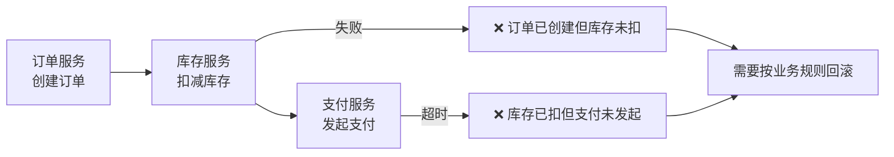
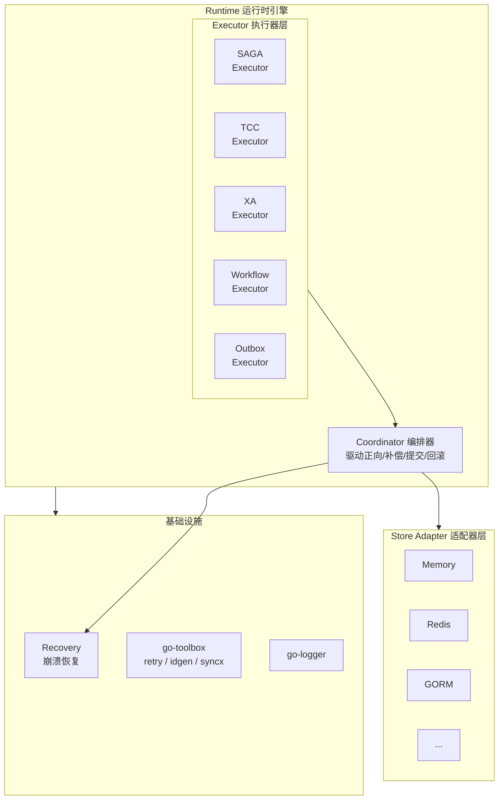
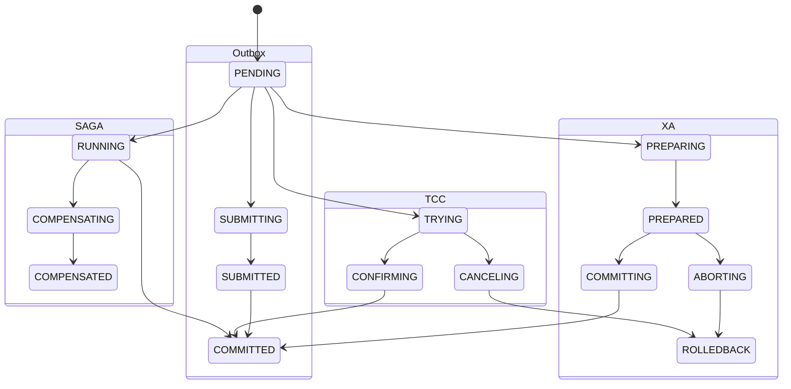
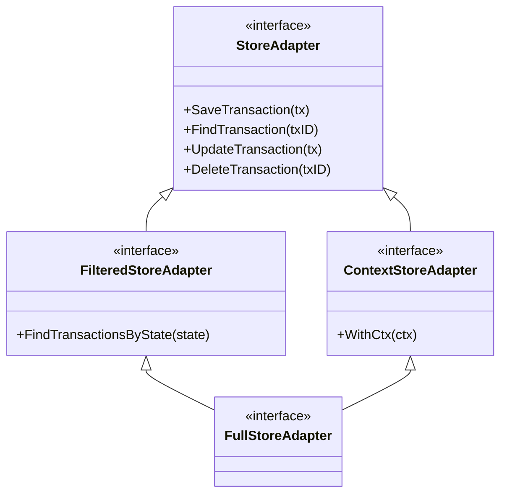

<div align="center">

# 🔄 Go-DistSaga

**高效分布式事务 SDK - 让跨服务数据一致性更简单**

*支持 SAGA / TCC / XA / Workflow / Outbox 五种事务模式，适配器可插拔*

<br />

[](https://github.com/kamalyes/go-distsaga)
[](LICENSE)
[](https://golang.org/)
[](https://goreportcard.com/report/github.com/kamalyes/go-distsaga)
[](https://pkg.go.dev/github.com/kamalyes/go-distsaga)

<br />

</div>

***

## 问题背景

在微服务架构中，一个业务操作往往需要跨多个服务协调完成：



**go-distsaga** 提供了五种分布式事务模式来解决这个问题

***

## 支持的事务模式

| 模式           | 一致性  | 侵入性                        | 适用场景        |
| ------------ | ---- | -------------------------- | ----------- |
| **SAGA**     | 最终一致 | 低 (Action + Compensate)    | 微服务编排，跨服务调用 |
| **TCC**      | 较强一致 | 高 (Try + Confirm + Cancel) | 金融，库存扣减     |
| **XA**       | 强一致  | 低 (需 DB 支持 XA)             | 低并发强一致场景    |
| **Workflow** | 可混合  | 中 (灵活编排)                   | 复杂业务流，混合模式  |
| **Outbox**   | 最终一致 | 最低 (无需回滚)                  | 事件发布，异步通知   |

***

## 架构设计



***

## 状态机



***

## 快速开始

### 环境要求

- Go 1.20+

### 安装

```bash
go get -u github.com/kamalyes/go-distsaga
```

### SAGA 模式

```go
package main

import (
    "context"
    "fmt"

    distsaga "github.com/kamalyes/go-distsaga"
    "github.com/kamalyes/go-distsaga/saga"
)

func main() {
    rt, _ := runtime.New()

    result, err := rt.Saga(ctx, "order:create",
        saga.WithSteps(
            saga.NewStep("create-order",
                func(ctx context.Context) (distsaga.StepResult, error) {
                    return distsaga.StepResult{Data: map[string]string{"order_id": "ORD-001"}}, nil
                },
                func(ctx context.Context, result distsaga.StepResult) error {
                    return nil
                },
            ),
            saga.NewStep("deduct-stock",
                func(ctx context.Context) (distsaga.StepResult, error) {
                    return distsaga.StepResult{}, nil
                },
                func(ctx context.Context, result distsaga.StepResult) error {
                    return nil
                },
            ),
        ),
    )

    fmt.Println(result.State) // COMMITTED
}
```

### TCC 模式

```go
result, err := rt.TCC(ctx, "payment:deduct",
    tcc.WithBranches(
        tcc.NewBranch("freeze-amount",
            func(ctx context.Context) (distsaga.StepResult, error) {
                return distsaga.StepResult{Data: map[string]string{"frozen": "100"}}, nil
            },
            func(ctx context.Context, result distsaga.StepResult) error {
                return nil
            },
            func(ctx context.Context, result distsaga.StepResult) error {
                return nil
            },
        ),
    ),
)
```

### XA 模式

```go
result, err := rt.XA(ctx, "transfer:money",
    xa.WithBranches(
        xa.NewBranch("account-out", &accountOutResource{}),
        xa.NewBranch("account-in", &accountInResource{}),
    ),
)

type accountOutResource struct{}
func (r *accountOutResource) Prepare(ctx context.Context) error { return nil }
func (r *accountOutResource) Commit(ctx context.Context) error   { return nil }
func (r *accountOutResource) Rollback(ctx context.Context) error { return nil }
```

### Workflow 模式

```go
result, err := rt.Workflow(ctx, "complex:order",
    workflow.WithHandler(func(wf *workflow.Workflow, data []byte) error {
        wf.OnRollback(func(ctx context.Context, data []byte) error {
            return rollbackOrder(ctx)
        })
        if err := createOrder(ctx); err != nil {
            return err
        }
        wf.OnConfirm(func(ctx context.Context, data []byte) error {
            return confirmOrder(ctx)
        })
        return nil
    }),
)
```

### Outbox 模式

```go
result, err := rt.Outbox(ctx, "send-notification",
    outbox.WithMessages(
        &outbox.Message{
            ID:     "msg-001",
            Target: "https://notify-service/api/send",
            Body:   []byte(`{"event": "order_created"}`),
        },
    ),
    outbox.WithBusinessOp(func(ctx context.Context) error {
        return saveOrder(ctx)
    }),
)
```

***

## 适配器

| 适配器    | 包                                               | 说明                                      |
| ------ | ----------------------------------------------- | --------------------------------------- |
| Memory | `github.com/kamalyes/go-distsaga`               | 内存适配器，用于测试和简单场景                         |
| Redis  | `github.com/kamalyes/go-distsaga-redis-adapter` | 基于 Redis 的存储和通知适配器                      |
| GORM   | `github.com/kamalyes/go-distsaga-gorm-adapter`  | 基于 GORM 的存储适配器，支持 MySQL/Postgres/SQLite |

### 适配器接口层级



***

## 项目结构

```
go-distsaga/
├── adapter.go              # StoreAdapter 接口定义
├── notifier.go             # TransactionNotifier 接口定义
├── state.go                # 事务状态枚举 + 状态机
├── step.go                 # 共享类型 (StepResult / StepStateItem / ...)
├── transaction.go          # Transaction 核心数据模型
├── errors.go               # 错误定义
├── memory_adapter.go       # 内置内存适配器
├── recovery.go             # 崩溃恢复
├── logger.go               # 日志 (复用 go-logger)
├── saga/                   # SAGA 模式
│   ├── executor.go
│   ├── step.go
│   └── options.go
├── tcc/                    # TCC 模式
│   ├── executor.go
│   ├── branch.go
│   └── options.go
├── xa/                     # XA 模式
│   ├── executor.go
│   ├── resource.go
│   └── options.go
├── workflow/               # Workflow 模式
│   ├── executor.go
│   ├── branch.go
│   └── options.go
├── outbox/                 # Outbox 模式
│   ├── executor.go
│   ├── message.go
│   └── options.go
├── runtime/                # 运行时引擎
│   ├── runtime.go
│   ├── coordinator.go
│   └── options.go
└── docs/                   # 详细文档
    ├── 01.SAGA.md
    ├── 02.TCC.md
    ├── 03.XA.md
    ├── 04.WORKFLOW.md
    ├── 05.OUTBOX.md
    ├── 06.RUNTIME.md
    ├── 07.ADAPTER.md
    └── 08.RECOVERY.md
```

***

## 详细文档

| 文档                                     | 说明                                |
| -------------------------------------- | --------------------------------- |
| [01. SAGA 模式](docs/01.SAGA.md)         | 正向执行 + 逆序补偿                       |
| [02. TCC 模式](docs/02.TCC.md)           | Try / Confirm / Cancel 三阶段        |
| [03. XA 模式](docs/03.XA.md)             | Prepare / Commit / Rollback 两阶段提交 |
| [04. Workflow 模式](docs/04.WORKFLOW.md) | 灵活编排，可混合 SAGA/TCC/XA              |
| [05. Outbox 模式](docs/05.OUTBOX.md)     | 两阶段消息（Better Outbox）              |
| [06. Runtime 引擎](docs/06.RUNTIME.md)   | 运行时引擎，统一入口                        |
| [07. Adapter 适配器](docs/07.ADAPTER.md)  | 存储适配器接口与实现                        |
| [08. Recovery 恢复](docs/08.RECOVERY.md) | 崩溃恢复与定时扫描                         |

***

## 依赖

| 依赖                                                   | 用途                                      |
| ---------------------------------------------------- | --------------------------------------- |
| [go-toolbox](https://github.com/kamalyes/go-toolbox) | retry (重试) / idgen (ID 生成) / syncx (并发) |
| [go-logger](https://github.com/kamalyes/go-logger)   | 统一日志                                    |

***

## License

[MIT License](LICENSE)
