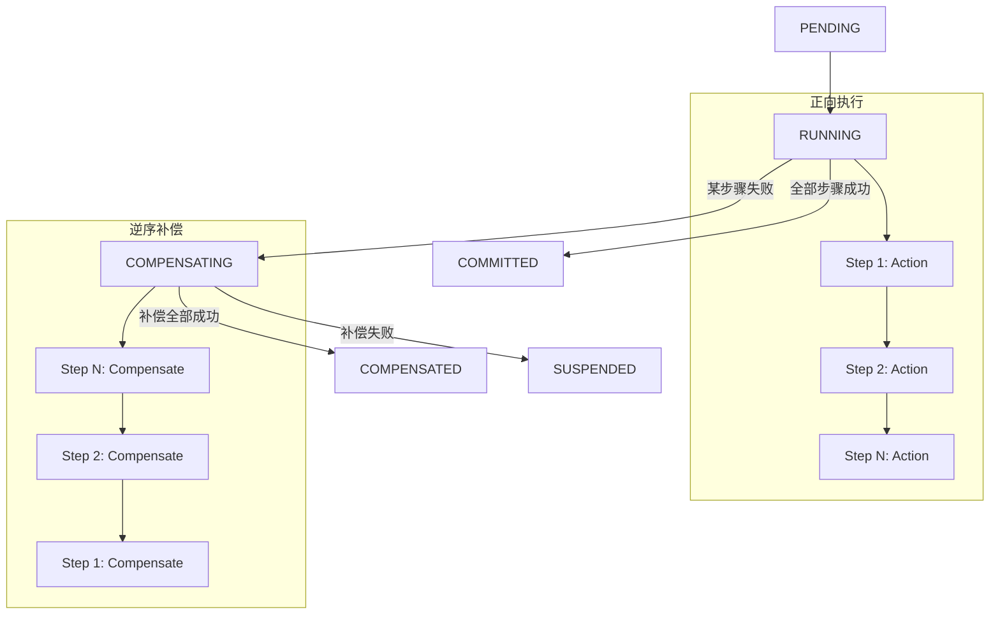
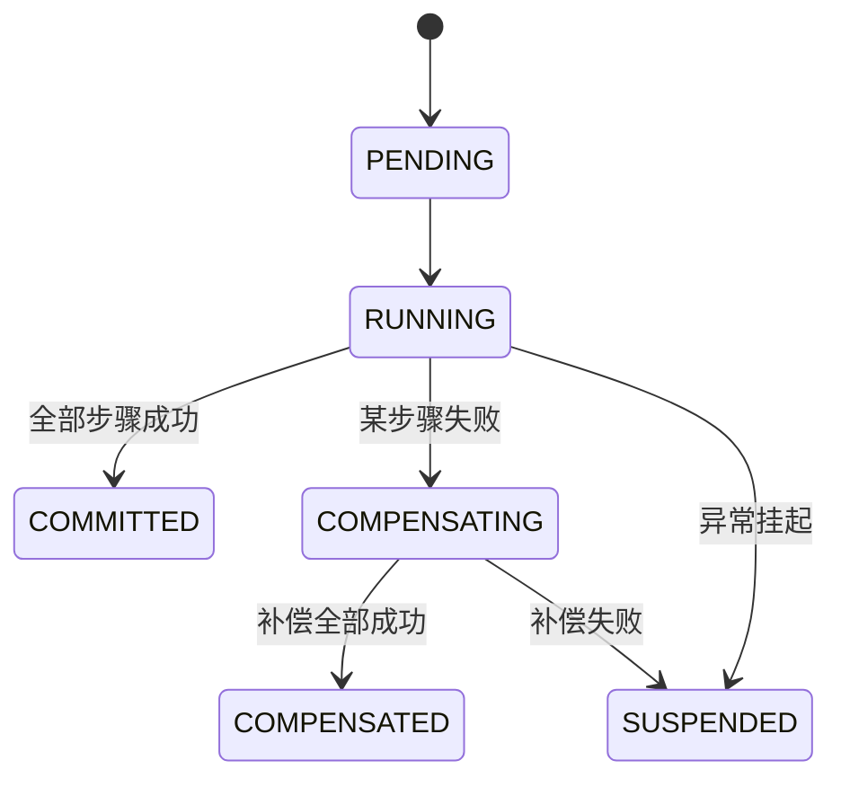
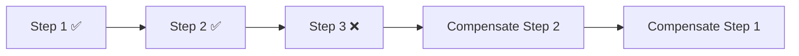

# SAGA 模式

SAGA 是一种基于补偿的分布式事务模式，按顺序执行正向步骤，任一步骤失败则逆序执行已完成步骤的补偿操作，最终保证数据一致性

## 执行流程



## 核心概念

### Step（步骤）

每个 SAGA 步骤包含两个动作：

| 动作 | 说明 | 函数签名 |
|------|------|----------|
| **Action** | 正向操作，执行业务逻辑 | `func(ctx context.Context) (StepResult, error)` |
| **Compensate** | 补偿操作，回滚正向操作的结果 | `func(ctx context.Context, result StepResult) error` |

### StepResult（步骤结果）

正向操作返回的结果，会传递给对应的补偿操作：

```go
type StepResult struct {
    Data  map[string]string
    Error error
}
```

## 状态流转



| 状态 | 说明 |
|------|------|
| PENDING | 事务已创建，等待执行 |
| RUNNING | 正在执行正向步骤 |
| COMMITTED | 全部正向步骤成功，事务已提交（终态） |
| COMPENSATING | 正在逆序执行补偿操作 |
| COMPENSATED | 补偿全部完成，事务已回滚（终态） |
| SUSPENDED | 补偿失败，需人工干预或恢复模块重试 |

## 使用示例

### 基本用法

```go
package main

import (
    "context"
    "fmt"

    distsaga "github.com/kamalyes/go-distsaga"
    "github.com/kamalyes/go-distsaga/runtime"
    "github.com/kamalyes/go-distsaga/saga"
)

func main() {
    rt, _ := runtime.New()

    result, err := rt.Saga(ctx, "order:create",
        saga.WithSteps(
            saga.NewStep("create-order",
                func(ctx context.Context) (distsaga.StepResult, error) {
                    return distsaga.StepResult{Data: map[string]string{"order_id": "ORD-001"}}, nil
                },
                func(ctx context.Context, result distsaga.StepResult) error {
                    return deleteOrder(ctx, result.Data["order_id"])
                },
            ),
            saga.NewStep("deduct-stock",
                func(ctx context.Context) (distsaga.StepResult, error) {
                    return distsaga.StepResult{}, nil
                },
                func(ctx context.Context, result distsaga.StepResult) error {
                    return restoreStock(ctx)
                },
            ),
            saga.NewStep("process-payment",
                func(ctx context.Context) (distsaga.StepResult, error) {
                    return distsaga.StepResult{}, nil
                },
                func(ctx context.Context, result distsaga.StepResult) error {
                    return refundPayment(ctx)
                },
            ),
        ),
    )

    if err != nil {
        fmt.Printf("事务失败: %v\n", err)
    } else {
        fmt.Printf("事务状态: %s\n", result.State)
    }
}
```

### 步骤级超时和重试

```go
saga.NewStep("call-external-api",
    actionFunc,
    compensateFunc,
).WithTimeout(5 * time.Second).WithRetries(3)
```

### 全局步骤超时

```go
rt.Saga(ctx, "order:create",
    saga.WithStepTimeout(10*time.Second),
    saga.WithSteps(
        saga.NewStep("step-1", action1, compensate1),
        saga.NewStep("step-2", action2, compensate2),
    ),
)
```

## 补偿机制

### 逆序补偿

当步骤 N 失败时，按 N-1 → N-2 → ... → 1 的顺序执行补偿：



### 补偿失败处理

- 补偿操作失败时，事务进入 **SUSPENDED** 状态
- 恢复模块会定时扫描 SUSPENDED 事务并重试补偿
- 超龄事务（超过 `recoveryMaxAge`）将被跳过，需人工干预

### 空补偿

补偿操作应设计为幂等，即多次执行与一次执行效果相同：

```go
func compensateOrder(ctx context.Context, result distsaga.StepResult) error {
    orderID := result.Data["order_id"]
    if orderID == "" {
        return nil // 空补偿：正向未产生结果，无需回滚
    }
    return deleteOrder(ctx, orderID)
}
```

## API 参考

### saga.NewStep

```go
func NewStep(name string, action ActionFunc, compensate CompensateFunc) *Step
```

创建 SAGA 步骤

**参数**：
- `name` — 步骤名称，用于日志和追踪
- `action` — 正向动作函数
- `compensate` — 补偿动作函数

### saga.WithSteps

```go
func WithSteps(steps ...*Step) Option
```

添加 SAGA 步骤

### saga.WithStepTimeout

```go
func WithStepTimeout(timeout time.Duration) Option
```

设置全局步骤超时时间，未单独设置超时的步骤将使用此值

### Step.WithTimeout

```go
func (s *Step) WithTimeout(timeout time.Duration) *Step
```

设置单个步骤的超时时间，覆盖全局设置

### Step.WithRetries

```go
func (s *Step) WithRetries(retries int) *Step
```

设置单个步骤的重试次数
