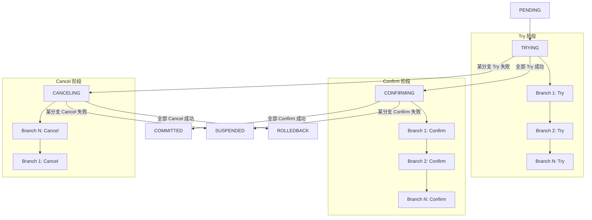
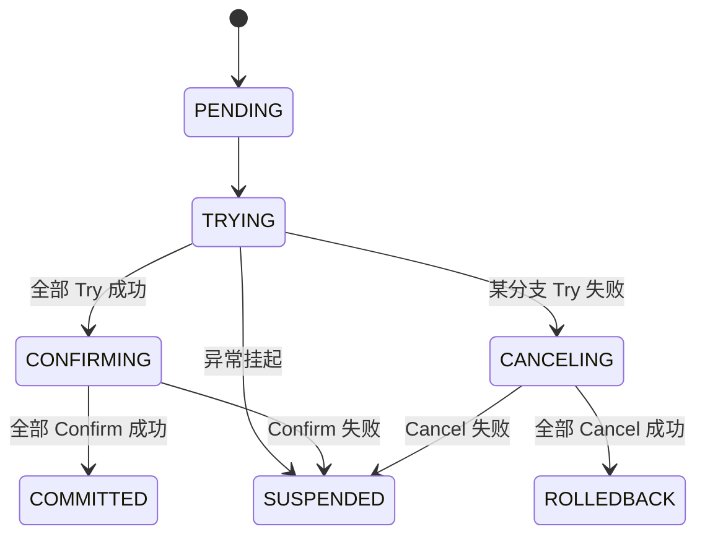

# TCC 模式

TCC（Try-Confirm-Cancel）是一种强一致性的分布式事务模式，将每个分支分为资源预留、确认提交和取消回滚三个阶段，适用于金融、库存扣减等对一致性要求较高的场景

## 执行流程



## 核心概念

### Branch（分支）

每个 TCC 分支包含三个阶段：

| 阶段 | 函数签名 | 说明 |
|------|----------|------|
| **Try** | `func(ctx Context) (StepResult, error)` | 资源预留，冻结但不提交 |
| **Confirm** | `func(ctx Context, result StepResult) error` | 确认提交，消耗预留资源 |
| **Cancel** | `func(ctx Context, result StepResult) error` | 取消回滚，释放预留资源 |

### 与 SAGA 的区别

| 特性 | SAGA | TCC |
|------|------|-----|
| 一致性 | 最终一致 | 较强一致 |
| 侵入性 | 低（Action + Compensate） | 高（Try + Confirm + Cancel） |
| 资源锁定 | 无 | Try 阶段预留资源 |
| 回滚方式 | 逆序补偿 | 逆序 Cancel |
| 适用场景 | 跨服务编排 | 金融、库存 |

## 状态流转



| 状态 | 说明 |
|------|------|
| PENDING | 事务已创建，等待执行 |
| TRYING | 正在执行 Try 阶段 |
| CONFIRMING | 正在执行 Confirm 阶段 |
| CANCELING | 正在逆序执行 Cancel 阶段 |
| COMMITTED | 全部 Confirm 成功，事务已提交（终态） |
| ROLLEDBACK | 全部 Cancel 成功，事务已回滚（终态） |
| SUSPENDED | Confirm 或 Cancel 失败，需人工干预 |

## 使用示例

### 基本用法

```go
package main

import (
    "context"
    "fmt"

    distsaga "github.com/kamalyes/go-distsaga"
    "github.com/kamalyes/go-distsaga/runtime"
    "github.com/kamalyes/go-distsaga/tcc"
)

func main() {
    rt, _ := runtime.New()

    result, err := rt.TCC(ctx, "payment:deduct",
        tcc.WithBranches(
            tcc.NewBranch("freeze-amount",
                func(ctx context.Context) (distsaga.StepResult, error) {
                    err := freezeAmount(ctx, "ACC-001", 100)
                    return distsaga.StepResult{Data: map[string]string{"frozen": "100"}}, err
                },
                func(ctx context.Context, result distsaga.StepResult) error {
                    return deductFrozenAmount(ctx, "ACC-001", 100)
                },
                func(ctx context.Context, result distsaga.StepResult) error {
                    return unfreezeAmount(ctx, "ACC-001", 100)
                },
            ),
            tcc.NewBranch("reserve-stock",
                func(ctx context.Context) (distsaga.StepResult, error) {
                    return distsaga.StepResult{}, reserveStock(ctx, "SKU-001", 1)
                },
                func(ctx context.Context, result distsaga.StepResult) error {
                    return confirmStockReservation(ctx, "SKU-001", 1)
                },
                func(ctx context.Context, result distsaga.StepResult) error {
                    return cancelStockReservation(ctx, "SKU-001", 1)
                },
            ),
        ),
    )

    fmt.Printf("事务状态: %s\n", result.State)
}
```

### 分支级超时和重试

```go
tcc.NewBranch("call-bank-api",
    tryFunc,
    confirmFunc,
    cancelFunc,
).WithTimeout(5 * time.Second).WithRetries(3)
```

## 关键问题处理

### 幂等性

Try / Confirm / Cancel 三个阶段都必须保证幂等，即重复调用不会产生副作用：

```go
func tryFreeze(ctx context.Context) (distsaga.StepResult, error) {
    txID := distsaga.GetTxIDFromCtx(ctx)
    if alreadyFrozen(txID) {
        return distsaga.StepResult{Data: map[string]string{"frozen": "100"}}, nil
    }
    return doFreeze(ctx, txID, 100)
}
```

### 空补偿

Cancel 阶段可能在 Try 未执行或未成功时被调用，需处理空补偿：

```go
func cancelFreeze(ctx context.Context, result distsaga.StepResult) error {
    if result.Data == nil {
        return nil // Try 未产生结果，无需 Cancel
    }
    return unfreezeAmount(ctx, "ACC-001", 100)
}
```

### 悬挂问题

Try 请求因网络延迟晚于 Cancel 到达时，资源被冻结但无法释放解决方案是在 Try 阶段检查是否已执行过 Cancel：

```go
func tryFreeze(ctx context.Context) (distsaga.StepResult, error) {
    if isAlreadyCancelled(txID) {
        return distsaga.StepResult{}, fmt.Errorf("branch already cancelled")
    }
    return doFreeze(ctx, txID, 100)
}
```

## API 参考

### tcc.NewBranch

```go
func NewBranch(name string, try TryFunc, confirm ConfirmFunc, cancel CancelFunc) *Branch
```

创建 TCC 分支

**参数**：
- `name` — 分支名称
- `try` — Try 阶段函数：资源预留
- `confirm` — Confirm 阶段函数：确认提交
- `cancel` — Cancel 阶段函数：取消回滚

### tcc.WithBranches

```go
func WithBranches(branches ...*Branch) Option
```

添加 TCC 分支

### tcc.WithStepTimeout

```go
func WithStepTimeout(timeout time.Duration) Option
```

设置全局分支超时时间

### Branch.WithTimeout

```go
func (b *Branch) WithTimeout(timeout time.Duration) *Branch
```

设置单个分支的超时时间

### Branch.WithRetries

```go
func (b *Branch) WithRetries(retries int) *Branch
```

设置单个分支的重试次数
