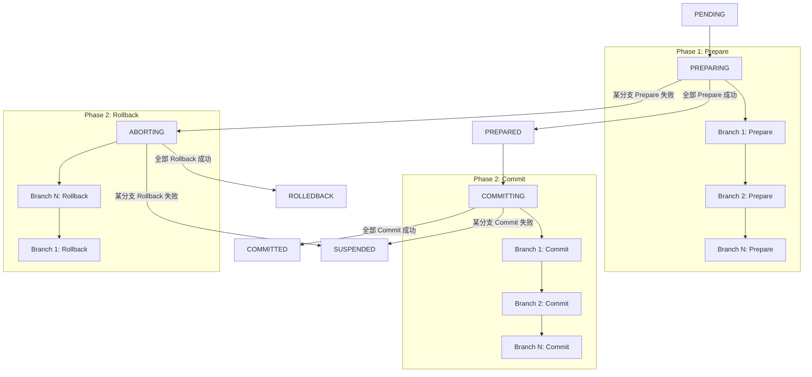
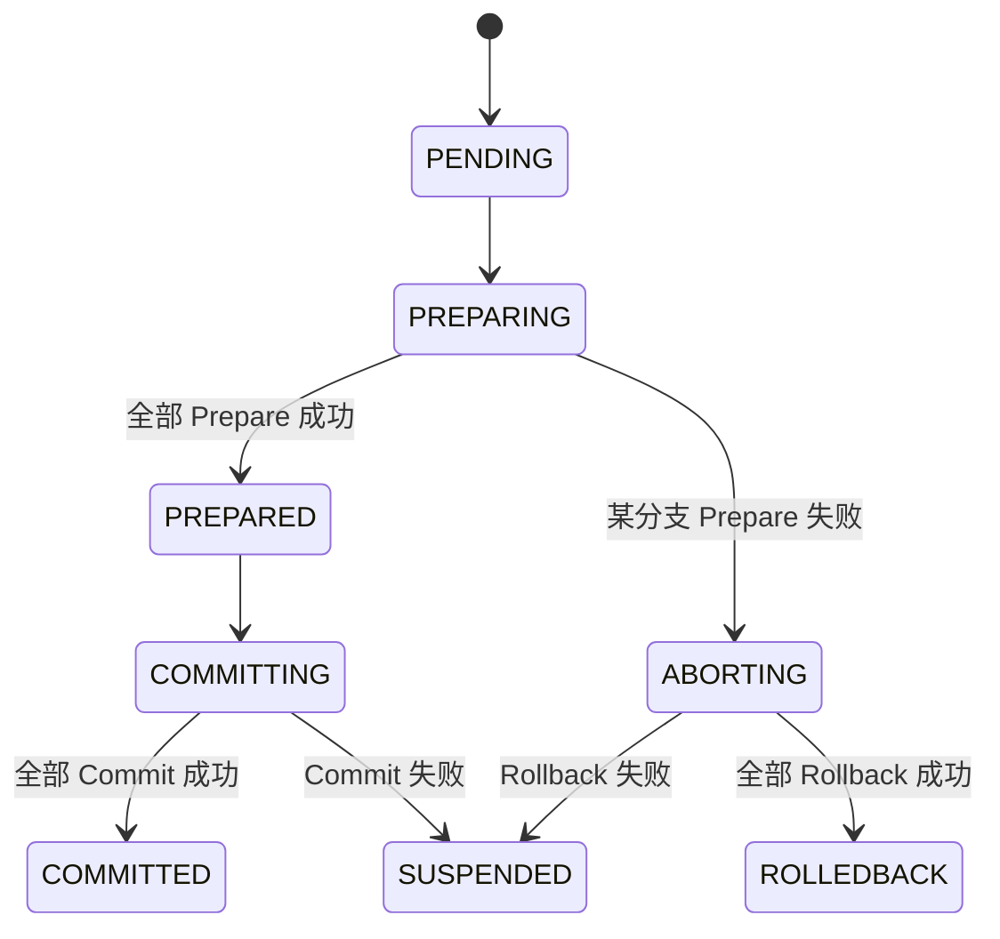

# XA 模式

XA 是一种基于两阶段提交协议（2PC）的强一致性分布式事务模式，要求参与事务的所有资源管理器（数据库）支持 XA 协议，适用于低并发但需要强一致性的场景

## 执行流程



## 核心概念

### Resource（资源接口）

XA 资源必须实现 `xa.Resource` 接口：

```go
type Resource interface {
    Prepare(ctx context.Context) error
    Commit(ctx context.Context) error
    Rollback(ctx context.Context) error
}
```

| 方法 | 说明 |
|------|------|
| **Prepare** | 第一阶段：准备提交，锁定资源但不真正提交 |
| **Commit** | 第二阶段：确认提交，持久化数据 |
| **Rollback** | 第二阶段：回滚，释放锁定的资源 |

### Branch（分支）

XA 分支绑定一个 Resource 实例：

```go
type Branch struct {
    Name     string        // 分支名称
    Resource Resource      // XA 资源
    Timeout  time.Duration // 超时时间
}
```

## 状态流转



| 状态 | 说明 |
|------|------|
| PENDING | 事务已创建，等待执行 |
| PREPARING | 正在执行 Prepare 阶段 |
| PREPARED | 全部 Prepare 成功，等待提交 |
| COMMITTING | 正在执行 Commit 阶段 |
| ABORTING | 正在执行 Rollback 阶段 |
| COMMITTED | 全部 Commit 成功（终态） |
| ROLLEDBACK | 全部 Rollback 成功（终态） |
| SUSPENDED | Commit 或 Rollback 失败，需人工干预 |

## 使用示例

### 基本用法

```go
package main

import (
    "context"
    "database/sql"
    "fmt"

    "github.com/kamalyes/go-distsaga/runtime"
    "github.com/kamalyes/go-distsaga/xa"
)

type dbResource struct {
    db *sql.DB
}

func (r *dbResource) Prepare(ctx context.Context) error {
    _, err := r.db.ExecContext(ctx, "XA START 'xa-tx-1'")
    if err != nil {
        return err
    }
    _, err = r.db.ExecContext(ctx, "UPDATE accounts SET balance = balance - 100 WHERE id = 'A'")
    if err != nil {
        return err
    }
    _, err = r.db.ExecContext(ctx, "XA END 'xa-tx-1'")
    if err != nil {
        return err
    }
    _, err = r.db.ExecContext(ctx, "XA PREPARE 'xa-tx-1'")
    return err
}

func (r *dbResource) Commit(ctx context.Context) error {
    _, err := r.db.ExecContext(ctx, "XA COMMIT 'xa-tx-1'")
    return err
}

func (r *dbResource) Rollback(ctx context.Context) error {
    _, err := r.db.ExecContext(ctx, "XA ROLLBACK 'xa-tx-1'")
    return err
}

func main() {
    rt, _ := runtime.New()

    result, err := rt.XA(ctx, "transfer:money",
        xa.WithBranches(
            xa.NewBranch("account-out", &dbResource{db: dbA}),
            xa.NewBranch("account-in", &dbResource{db: dbB}),
        ),
    )

    fmt.Printf("事务状态: %s\n", result.State)
}
```

### 分支级超时

```go
xa.NewBranch("slow-db", &slowDBResource{}).WithTimeout(30 * time.Second)
```

## 与 SAGA / TCC 的对比

| 特性 | SAGA | TCC | XA |
|------|------|-----|-----|
| 一致性 | 最终一致 | 较强一致 | 强一致 |
| 侵入性 | 低 | 高 | 低（需 DB 支持 XA） |
| 性能 | 高 | 中 | 低（长时间锁定） |
| 资源锁定 | 无 | Try 阶段预留 | Prepare 阶段锁定 |
| 适用场景 | 跨服务编排 | 金融、库存 | 低并发强一致 |

## 注意事项

1. **数据库支持**：参与 XA 事务的数据库必须支持 XA 协议（MySQL、PostgreSQL、MariaDB 等主流数据库均支持）
2. **性能开销**：Prepare 阶段会锁定资源，长时间持有锁可能影响并发性能
3. **超时设置**：建议为每个分支设置合理的超时时间，避免长时间阻塞
4. **悬挂问题**：Prepare 成功但 Coordinator 崩溃，重启后需通过恢复模块继续 Commit 或 Rollback
5. **单点故障**：Coordinator 是单点，需确保其高可用

## API 参考

### xa.NewBranch

```go
func NewBranch(name string, resource Resource) *Branch
```

创建 XA 分支

**参数**：

- `name` — 分支名称
- `resource` — 实现 `xa.Resource` 接口的资源实例

### xa.WithBranches

```go
func WithBranches(branches ...*Branch) Option
```

添加 XA 分支

### Branch.WithTimeout

```go
func (b *Branch) WithTimeout(timeout time.Duration) *Branch
```

设置分支超时时间

### xa.Resource 接口

```go
type Resource interface {
    Prepare(ctx context.Context) error
    Commit(ctx context.Context) error
    Rollback(ctx context.Context) error
}
```
