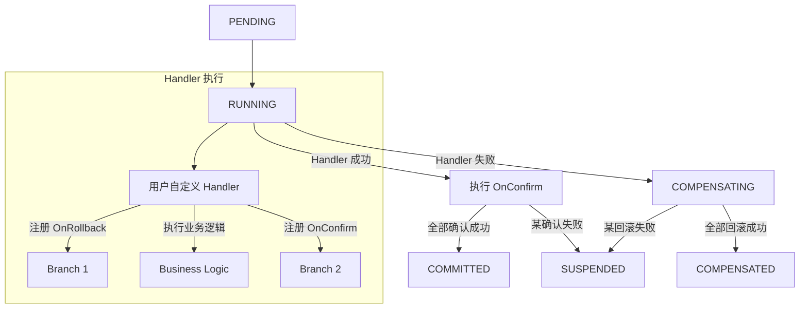
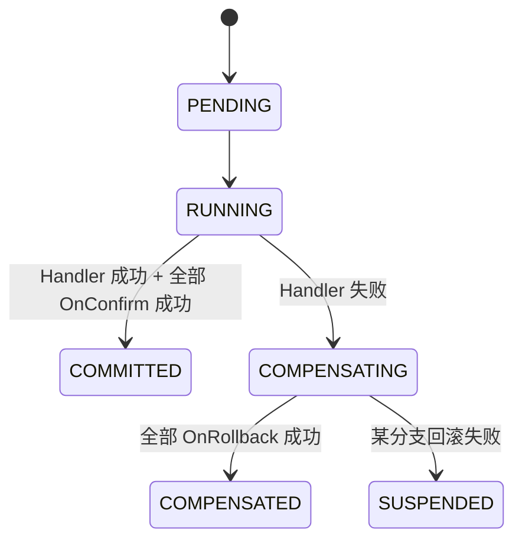
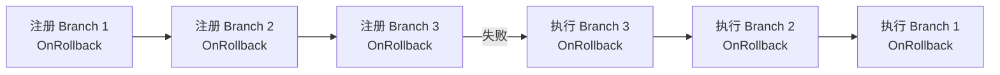

# Workflow 模式

Workflow 是一种灵活的分布式事务编排模式，允许在执行过程中动态注册确认和回滚分支，可混合 SAGA / TCC / XA 的语义，适用于复杂业务流程

## 执行流程



## 核心概念

### Workflow 上下文

Workflow 模式的核心是 `Workflow` 上下文对象，在 Handler 中通过它动态注册分支：

```go
type Workflow struct {
    ID      string         // 工作流 ID
    Context context.Context // 工作流上下文
}
```

### 分支注册

在 Handler 中可以动态注册三种回调：

| 方法 | 说明 | 时机 |
|------|------|------|
| `wf.OnRollback(fn)` | 注册回滚回调 | Handler 失败时逆序执行 |
| `wf.OnConfirm(fn)` | 注册确认回调 | Handler 成功时顺序执行 |
| `wf.OnCancel(fn)` | 注册取消回调 | 作为 OnRollback 的备选 |

### 与 SAGA 的区别

| 特性 | SAGA | Workflow |
|------|------|----------|
| 步骤定义 | 预先定义 | 动态注册 |
| 执行顺序 | 固定顺序 | 由 Handler 控制 |
| 灵活性 | 低 | 高 |
| 适用场景 | 标准编排 | 复杂业务流 |

## 状态流转



> Workflow 复用 SAGA 的状态流转表

## 使用示例

### 基本用法

```go
package main

import (
    "context"
    "fmt"

    "github.com/kamalyes/go-distsaga/runtime"
    "github.com/kamalyes/go-distsaga/workflow"
)

func main() {
    rt, _ := runtime.New()

    result, err := rt.Workflow(ctx, "complex:order",
        workflow.WithHandler(func(wf *workflow.Workflow, data []byte) error {
            // 先注册回滚分支（在执行业务之前注册，确保失败时能回滚）
            wf.OnRollback(func(ctx context.Context, data []byte) error {
                return rollbackOrder(ctx)
            })

            // 执行业务逻辑
            if err := createOrder(ctx); err != nil {
                return err // 返回错误触发回滚
            }

            // 注册确认分支
            wf.OnConfirm(func(ctx context.Context, data []byte) error {
                return confirmOrder(ctx)
            })

            return nil
        }),
    )

    fmt.Printf("事务状态: %s\n", result.State)
}
```

### 多分支编排

```go
result, err := rt.Workflow(ctx, "complex:process",
    workflow.WithHandler(func(wf *workflow.Workflow, data []byte) error {
        // 步骤 1：创建资源
        if err := createResource(ctx); err != nil {
            return err
        }
        wf.OnRollback(func(ctx context.Context, data []byte) error {
            return deleteResource(ctx)
        })

        // 步骤 2：发送通知
        if err := sendNotification(ctx); err != nil {
            return err
        }
        wf.OnRollback(func(ctx context.Context, data []byte) error {
            return cancelNotification(ctx)
        })

        // 全部成功后确认
        wf.OnConfirm(func(ctx context.Context, data []byte) error {
            return finalizeProcess(ctx)
        })

        return nil
    }),
)
```

### 传递输入数据

```go
result, err := rt.Workflow(ctx, "process:with-data",
    workflow.WithHandler(func(wf *workflow.Workflow, data []byte) error {
        var req OrderRequest
        json.Unmarshal(data, &req)
        return processOrder(ctx, &req)
    }),
    workflow.WithData([]byte(`{"order_id": "ORD-001", "amount": 100}`)),
)
```

### 使用 OnCancel

`OnCancel` 是 `OnRollback` 的备选，当 `OnRollback` 未注册时使用 `OnCancel`：

```go
wf.OnCancel(func(ctx context.Context, data []byte) error {
    return cancelOperation(ctx)
})
```

**优先级**：`OnRollback` > `OnCancel` > 跳过

## 回滚顺序

回滚时按分支注册的**逆序**执行：



## API 参考

### workflow.WithHandler

```go
func WithHandler(handler Handler) Option
```

设置 Workflow 处理函数

**参数**：
- `handler` — 工作流处理函数，签名 `func(wf *Workflow, data []byte) error`

### workflow.WithData

```go
func WithData(data []byte) Option
```

设置工作流输入数据，传递给 Handler 的 `data` 参数

### Workflow.OnRollback

```go
func (wf *Workflow) OnRollback(fn func(ctx Context, data []byte) error) *Branch
```

注册回滚回调，Handler 失败时逆序执行

### Workflow.OnConfirm

```go
func (wf *Workflow) OnConfirm(fn func(ctx Context, data []byte) error) *Branch
```

注册确认回调，Handler 成功时顺序执行

### Workflow.OnCancel

```go
func (wf *Workflow) OnCancel(fn func(ctx Context, data []byte) error) *Branch
```

注册取消回调，作为 OnRollback 的备选

### Workflow.NewBranch

```go
func (wf *Workflow) NewBranch() *Branch
```

创建空分支，手动设置回调
