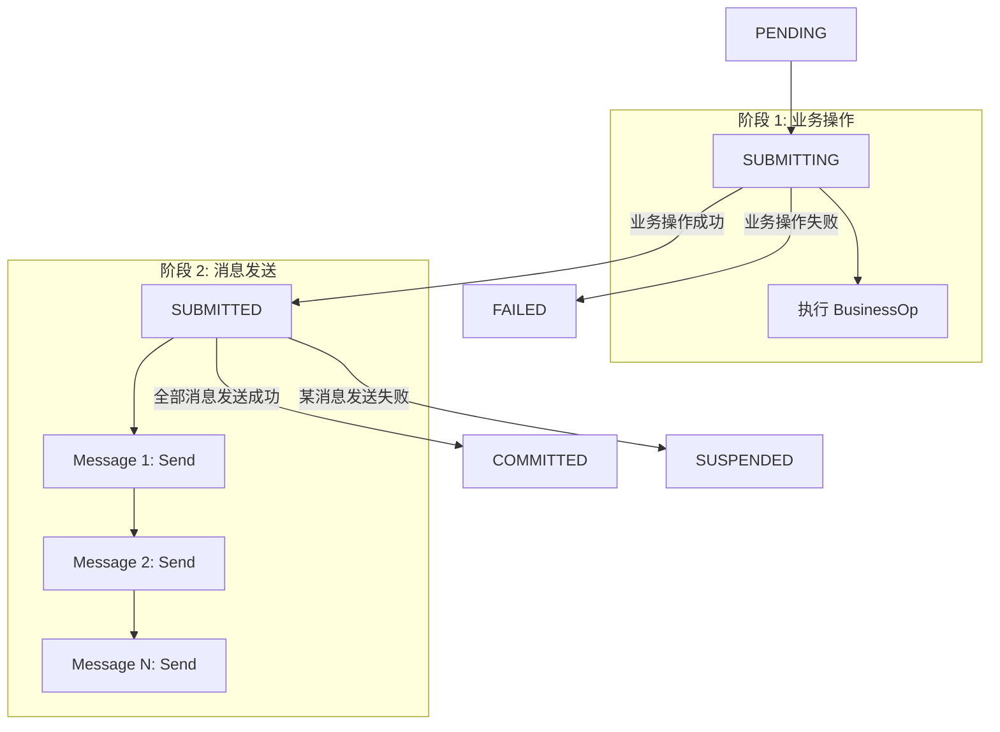
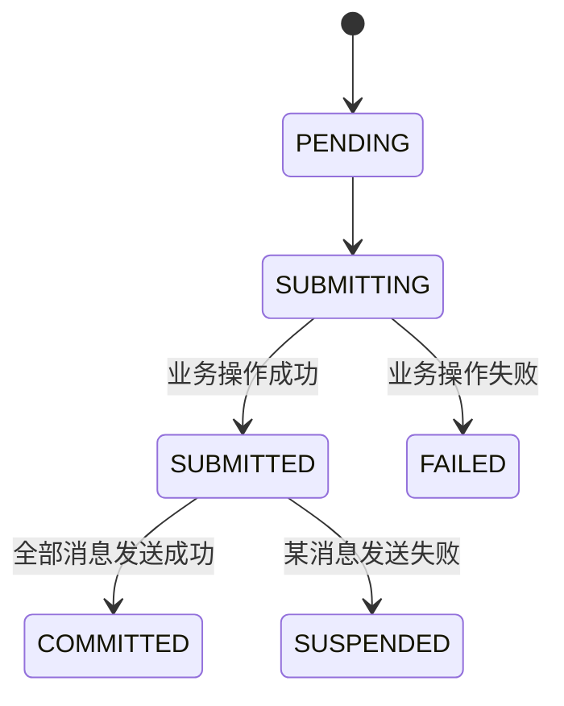
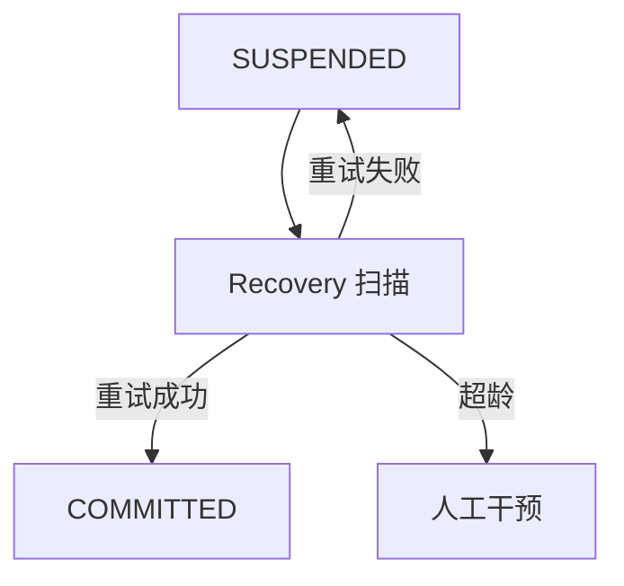

# Outbox 模式

Outbox（两阶段消息 / Better Outbox）是一种最低侵入性的分布式事务模式，先执行业务操作再发送消息，确保业务操作和消息发送的最终一致性，无需回滚逻辑

## 执行流程



## 核心概念

### BusinessOp（业务操作）

在发送消息之前执行的业务逻辑，例如保存订单、更新状态等业务操作成功后才会发送消息

```go
type BusinessOp func(ctx context.Context) error
```

### Message（消息）

Outbox 消息定义：

```go
type Message struct {
    ID       string            // 消息 ID
    Target   string            // 消息目标（如 HTTP URL、队列名）
    Body     []byte            // 消息体
    Headers  map[string]string // 消息头
    Delay    time.Duration     // 延迟发送时间
    Priority int               // 优先级
}
```

### Better Outbox vs 传统 Outbox

| 特性 | 传统 Outbox | Better Outbox |
|------|-------------|---------------|
| 消息存储 | 写入 Outbox 表 | 直接发送，无需轮询 |
| 消息投递 | 定时轮询 Outbox 表 | 实时发送 |
| 延迟 | 较高（取决于轮询间隔） | 较低 |
| 复杂度 | 需要维护 Outbox 表 | 无需额外表 |
| 可靠性 | 依赖轮询 | 依赖重试 + 恢复模块 |

## 状态流转



| 状态 | 说明 |
|------|------|
| PENDING | 事务已创建，等待执行 |
| SUBMITTING | 正在执行业务操作 |
| SUBMITTED | 业务操作成功，准备发送消息 |
| COMMITTED | 全部消息发送成功（终态） |
| FAILED | 业务操作失败（终态） |
| SUSPENDED | 消息发送失败，需恢复模块重试 |

## 使用示例

### 基本用法

```go
package main

import (
    "context"
    "fmt"

    "github.com/kamalyes/go-distsaga/runtime"
    "github.com/kamalyes/go-distsaga/outbox"
)

func main() {
    rt, _ := runtime.New()

    result, err := rt.Outbox(ctx, "send-notification",
        outbox.WithBusinessOp(func(ctx context.Context) error {
            return saveOrder(ctx)
        }),
        outbox.WithMessages(
            &outbox.Message{
                ID:     "msg-001",
                Target: "https://notify-service/api/send",
                Body:   []byte(`{"event": "order_created", "order_id": "ORD-001"}`),
            },
        ),
    )

    fmt.Printf("事务状态: %s\n", result.State)
}
```

### 多消息发送

```go
result, err := rt.Outbox(ctx, "order:events",
    outbox.WithBusinessOp(func(ctx context.Context) error {
        return saveOrder(ctx)
    }),
    outbox.WithMessages(
        &outbox.Message{
            ID:     "msg-001",
            Target: "https://notify-service/api/order-created",
            Body:   orderCreatedEvent,
        },
        &outbox.Message{
            ID:     "msg-002",
            Target: "https://inventory-service/api/reserve",
            Body:   reserveStockEvent,
        },
        &outbox.Message{
            ID:     "msg-003",
            Target: "https://analytics-service/api/track",
            Body:   analyticsEvent,
        },
    ),
)
```

### 仅发送消息（无业务操作）

```go
result, err := rt.Outbox(ctx, "broadcast:event",
    outbox.WithMessages(
        &outbox.Message{
            ID:     "msg-001",
            Target: "https://service-a/api/handle",
            Body:   eventData,
        },
    ),
)
```

### 带消息头和优先级

```go
&outbox.Message{
    ID:     "msg-001",
    Target: "https://priority-service/api/handle",
    Body:   []byte(`{"urgent": true}`),
    Headers: map[string]string{
        "X-Priority": "high",
        "X-Source":   "order-service",
    },
    Priority: 10,
}
```

## 消息发送失败处理

1. 消息发送失败时，事务进入 **SUSPENDED** 状态
2. 恢复模块定时扫描 SUSPENDED 事务
3. 对失败的消息进行重试
4. 超龄事务需人工干预



## 适用场景

| 场景 | 说明 |
|------|------|
| 事件发布 | 业务操作完成后发布领域事件 |
| 异步通知 | 订单创建后发送通知 |
| 跨服务同步 | 更新数据后通知其他服务 |
| 数据广播 | 数据变更后广播到多个下游 |

## API 参考

### outbox.WithMessages

```go
func WithMessages(messages ...*Message) Option
```

批量添加 Outbox 消息

### outbox.WithMessage

```go
func WithMessage(msg *Message) Option
```

添加单条 Outbox 消息

### outbox.WithBusinessOp

```go
func WithBusinessOp(op func(ctx context.Context) error) Option
```

设置业务操作函数，在消息发送之前执行

### Message 结构体

```go
type Message struct {
    ID       string            // 消息 ID
    Target   string            // 消息目标
    Body     []byte            // 消息体
    Headers  map[string]string // 消息头
    Delay    time.Duration     // 延迟发送时间
    Priority int               // 优先级
}
```
