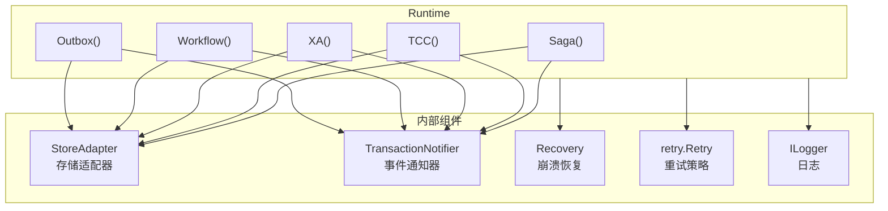
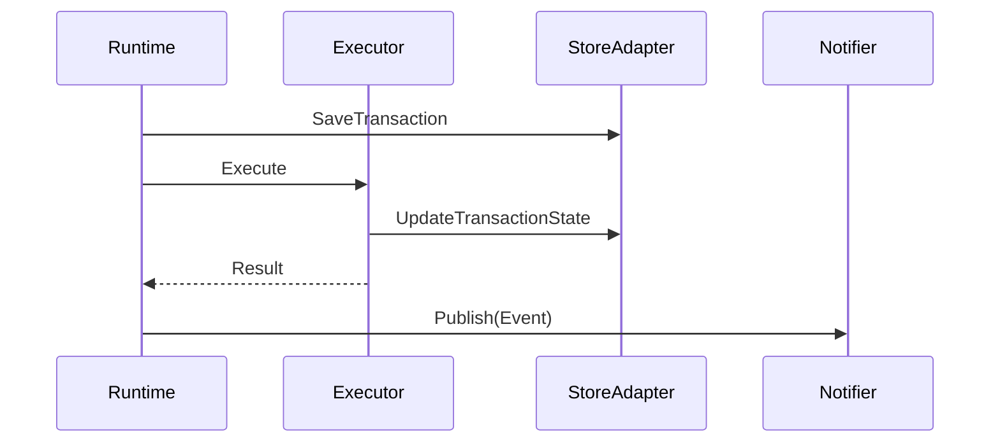
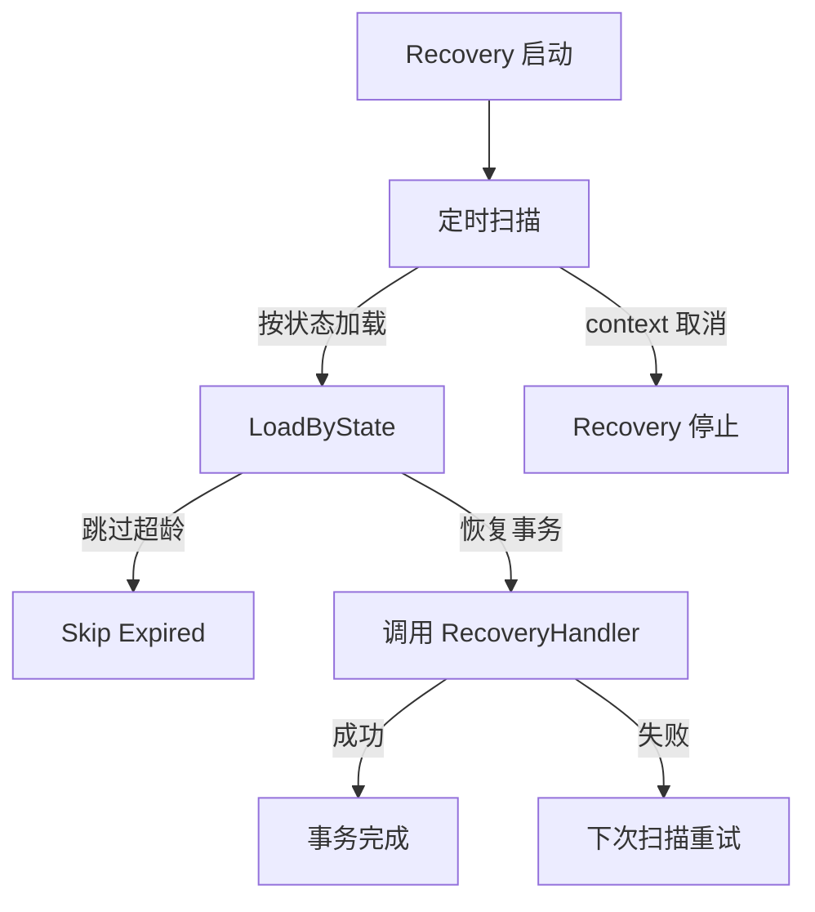

# Runtime 引擎

Runtime 是 go-distsaga 的运行时引擎，作为所有事务模式的统一入口，管理执行、通知和恢复

## 架构



## 创建 Runtime

### 默认配置

```go
rt, err := runtime.New()
```

默认配置：
- 适配器：MemoryAdapter（内存存储）
- 日志：DefaultLogger
- 重试：3 次重试，100ms 间隔
- 恢复扫描间隔：10s
- 步骤超时：30s
- 事务 TTL：72h

### 自定义配置

```go
rt, err := runtime.New(
    runtime.WithAdapter(redisAdapter),
    runtime.WithNotifier(redisNotifier),
    runtime.WithLogger(customLogger),
    runtime.WithRetry(retry.NewRetry().SetAttemptCount(5)),
    runtime.WithStepTimeout(10*time.Second),
    runtime.WithRecoveryInterval(5*time.Second),
    runtime.WithRecoveryMaxAge(48*time.Hour),
    runtime.WithTransactionTTL(24*time.Hour),
    runtime.WithEnableRecovery(true),
)
```

## 函数式选项

| 选项 | 说明 | 默认值 |
|------|------|--------|
| `WithAdapter(adapter)` | 设置存储适配器 | MemoryAdapter |
| `WithNotifier(notifier)` | 设置事务通知器 | nil |
| `WithLogger(l)` | 设置日志记录器 | DefaultLogger |
| `WithRetry(r)` | 设置重试策略 | 3 次 / 100ms |
| `WithStepTimeout(d)` | 设置步骤默认超时 | 30s |
| `WithRecoveryInterval(d)` | 设置恢复扫描间隔 | 10s |
| `WithRecoveryMaxAge(d)` | 设置恢复最大事务年龄 | 24h |
| `WithTransactionTTL(d)` | 设置事务存活时间 | 72h |
| `WithEnableRecovery(b)` | 是否启用恢复 | true |

## 执行事务

Runtime 提供五个方法对应五种事务模式：

### SAGA

```go
result, err := rt.Saga(ctx, "order:create",
    saga.WithSteps(
        saga.NewStep("step-1", action1, compensate1),
    ),
)
```

### TCC

```go
result, err := rt.TCC(ctx, "payment:deduct",
    tcc.WithBranches(
        tcc.NewBranch("branch-1", try1, confirm1, cancel1),
    ),
)
```

### XA

```go
result, err := rt.XA(ctx, "transfer:money",
    xa.WithBranches(
        xa.NewBranch("branch-1", resource1),
    ),
)
```

### Workflow

```go
result, err := rt.Workflow(ctx, "complex:order",
    workflow.WithHandler(func(wf *workflow.Workflow, data []byte) error {
        return nil
    }),
)
```

### Outbox

```go
result, err := rt.Outbox(ctx, "send-notification",
    outbox.WithMessages(&outbox.Message{ID: "msg-001", Target: "...", Body: []byte("...")}),
    outbox.WithBusinessOp(func(ctx context.Context) error {
        return nil
    }),
)
```

## 事件通知

事务执行完成后，Runtime 会自动发布事件到通知器：



### 事件类型

| 事件 | 说明 |
|------|------|
| `EventTransactionCreated` | 事务已创建 |
| `EventTransactionRunning` | 事务执行中 |
| `EventTransactionCommitted` | 事务已提交 |
| `EventTransactionCompensating` | 事务补偿中 |
| `EventTransactionCompensated` | 事务已补偿 |
| `EventTransactionRolledback` | 事务已回滚 |
| `EventTransactionFailed` | 事务失败 |
| `EventTransactionSuspended` | 事务挂起 |
| `EventStepCompleted` | 步骤已完成 |
| `EventStepFailed` | 步骤失败 |
| `EventStepCompensated` | 步骤已补偿 |

## 崩溃恢复

### 启动恢复

```go
ctx := context.Background()
rt.StartRecovery(ctx)
```

### 停止恢复

```go
rt.StopRecovery()
```

### 恢复流程



## 默认配置常量

| 常量 | 值 | 说明 |
|------|-----|------|
| `DefaultRecoveryInterval` | 10s | 恢复扫描间隔 |
| `DefaultRecoveryMaxAge` | 24h | 恢复最大事务年龄 |
| `DefaultStepTimeout` | 30s | 步骤默认超时 |
| `DefaultTransactionTTL` | 72h | 事务存活时间 |

## API 参考

### runtime.New

```go
func New(opts ...Option) (*Runtime, error)
```

创建分布式事务运行时适配器为 nil 时返回 `ErrInvalidAdapter`

### Runtime.Saga

```go
func (r *Runtime) Saga(ctx context.Context, name string, opts ...saga.Option) (*distsaga.Transaction, error)
```

执行 SAGA 事务至少需要一个步骤，否则返回 `ErrInvalidStep`

### Runtime.TCC

```go
func (r *Runtime) TCC(ctx context.Context, name string, opts ...tcc.Option) (*distsaga.Transaction, error)
```

执行 TCC 事务至少需要一个分支，否则返回 `ErrInvalidBranch`

### Runtime.XA

```go
func (r *Runtime) XA(ctx context.Context, name string, opts ...xa.Option) (*distsaga.Transaction, error)
```

执行 XA 事务至少需要一个分支，否则返回 `ErrInvalidBranch`

### Runtime.Workflow

```go
func (r *Runtime) Workflow(ctx context.Context, name string, opts ...workflow.Option) (*distsaga.Transaction, error)
```

执行 Workflow 事务必须提供 Handler，否则返回 `ErrInvalidStep`

### Runtime.Outbox

```go
func (r *Runtime) Outbox(ctx context.Context, name string, opts ...outbox.Option) (*distsaga.Transaction, error)
```

执行 Outbox 事务至少需要一条消息，否则返回 `ErrInvalidStep`

### Runtime.StartRecovery

```go
func (r *Runtime) StartRecovery(ctx context.Context) error
```

启动崩溃恢复恢复器为 nil 时返回 `ErrRecoveryFailed`

### Runtime.StopRecovery

```go
func (r *Runtime) StopRecovery()
```

停止崩溃恢复
