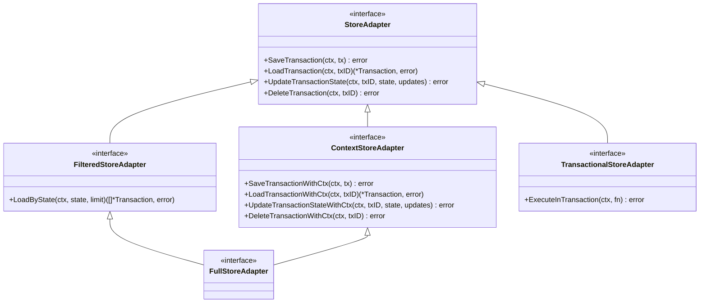

# Adapter 适配器

适配器是 go-distsaga 的存储抽象层，通过接口隔离事务逻辑与存储实现，支持可插拔的存储后端

## 接口层级



## 接口说明

### StoreAdapter（基础接口）

所有适配器必须实现的基础 CRUD 接口：

```go
type StoreAdapter interface {
    SaveTransaction(ctx context.Context, tx *Transaction) error
    LoadTransaction(ctx context.Context, txID string) (*Transaction, error)
    UpdateTransactionState(ctx context.Context, txID string, state TxState, updates map[string]interface{}) error
    DeleteTransaction(ctx context.Context, txID string) error
}
```

| 方法 | 说明 |
|------|------|
| `SaveTransaction` | 保存事务到存储 |
| `LoadTransaction` | 从存储加载事务 |
| `UpdateTransactionState` | 更新事务状态 |
| `DeleteTransaction` | 删除事务 |

### FilteredStoreAdapter（过滤接口）

扩展 StoreAdapter，增加按状态批量加载的能力，恢复模块依赖此接口：

```go
type FilteredStoreAdapter interface {
    StoreAdapter
    LoadByState(ctx context.Context, state TxState, limit int) ([]*Transaction, error)
}
```

### ContextStoreAdapter（上下文接口）

扩展 StoreAdapter，增加带 context 的 CRUD 方法，适用于超时控制和链路追踪：

```go
type ContextStoreAdapter interface {
    StoreAdapter
    SaveTransactionWithCtx(ctx context.Context, tx *Transaction) error
    LoadTransactionWithCtx(ctx context.Context, txID string) (*Transaction, error)
    UpdateTransactionStateWithCtx(ctx context.Context, txID string, state TxState, updates map[string]interface{}) error
    DeleteTransactionWithCtx(ctx context.Context, txID string) error
}
```

### FullStoreAdapter（全功能接口）

组合 ContextStoreAdapter 和 FilteredStoreAdapter，Redis 和 GORM 适配器均实现此接口：

```go
type FullStoreAdapter interface {
    ContextStoreAdapter
    FilteredStoreAdapter
}
```

### TransactionalStoreAdapter（事务接口）

扩展 StoreAdapter，支持在同一个数据库事务中执行多个操作：

```go
type TransactionalStoreAdapter interface {
    StoreAdapter
    ExecuteInTransaction(ctx context.Context, fn func(StoreAdapter) error) error
}
```

## 内置适配器

### MemoryAdapter

内存适配器，用于测试和简单场景，数据不持久化：

```go
adapter := distsaga.NewMemoryAdapter()
rt, _ := runtime.New(runtime.WithAdapter(adapter))
```

**特点**：
- 数据存储在内存中，进程退出即丢失
- 实现了 `FilteredStoreAdapter` 接口
- 线程安全（使用 sync.RWMutex 保护）
- 适合单元测试和本地开发

## 独立适配器包

### Redis 适配器

```go
import redisadapter "github.com/kamalyes/go-distsaga-redis-adapter"

adapter := redisadapter.New(redisClient)
rt, _ := runtime.New(runtime.WithAdapter(adapter))
```

**特点**：
- 实现 `FullStoreAdapter` 接口
- 基于 Redis Hash 存储事务数据
- 支持分布式锁
- 支持 Pub/Sub 事件通知
- 适合生产环境

### GORM 适配器

```go
import gormadapter "github.com/kamalyes/go-distsaga-gorm-adapter"

adapter := gormadapter.New(db)
rt, _ := runtime.New(runtime.WithAdapter(adapter))
```

**特点**：
- 实现 `FullStoreAdapter` + `TransactionalStoreAdapter` 接口
- 支持 MySQL / PostgreSQL / SQLite
- 事务操作在同一个数据库事务中执行
- 适合需要强一致存储的场景

## 自定义适配器

实现 `StoreAdapter` 接口即可创建自定义适配器：

```go
type MyAdapter struct {
    // ...
}

func (a *MyAdapter) SaveTransaction(ctx context.Context, tx *distsaga.Transaction) error {
    // 实现保存逻辑
    return nil
}

func (a *MyAdapter) LoadTransaction(ctx context.Context, txID string) (*distsaga.Transaction, error) {
    // 实现加载逻辑
    return nil, nil
}

func (a *MyAdapter) UpdateTransactionState(ctx context.Context, txID string, state distsaga.TxState, updates map[string]interface{}) error {
    // 实现更新逻辑
    return nil
}

func (a *MyAdapter) DeleteTransaction(ctx context.Context, txID string) error {
    // 实现删除逻辑
    return nil
}
```

如果需要支持恢复模块，还需实现 `FilteredStoreAdapter`：

```go
func (a *MyAdapter) LoadByState(ctx context.Context, state distsaga.TxState, limit int) ([]*distsaga.Transaction, error) {
    // 实现按状态加载逻辑
    return nil, nil
}
```

## 适配器选择指南

| 适配器 | 持久化 | 分布式 | 性能 | 适用场景 |
|--------|--------|--------|------|----------|
| Memory | ❌ | ❌ | ⚡ | 测试、开发 |
| Redis | ✅ | ✅ | 🚀 | 生产环境、高并发 |
| GORM | ✅ | ✅ | 📊 | 强一致存储、复杂查询 |

## 通知器接口

适配器包通常同时提供存储适配器和通知器实现：

```go
type TransactionNotifier interface {
    Publish(ctx context.Context, event *TransactionEvent) error
    Subscribe(ctx context.Context, handler TransactionEventHandler) error
    Unsubscribe() error
    Close() error
}
```

| 方法 | 说明 |
|------|------|
| `Publish` | 发布事务事件 |
| `Subscribe` | 订阅事务事件 |
| `Unsubscribe` | 取消订阅 |
| `Close` | 关闭通知器 |

Redis 适配器基于 Pub/Sub 实现通知器，Memory 适配器为空实现
