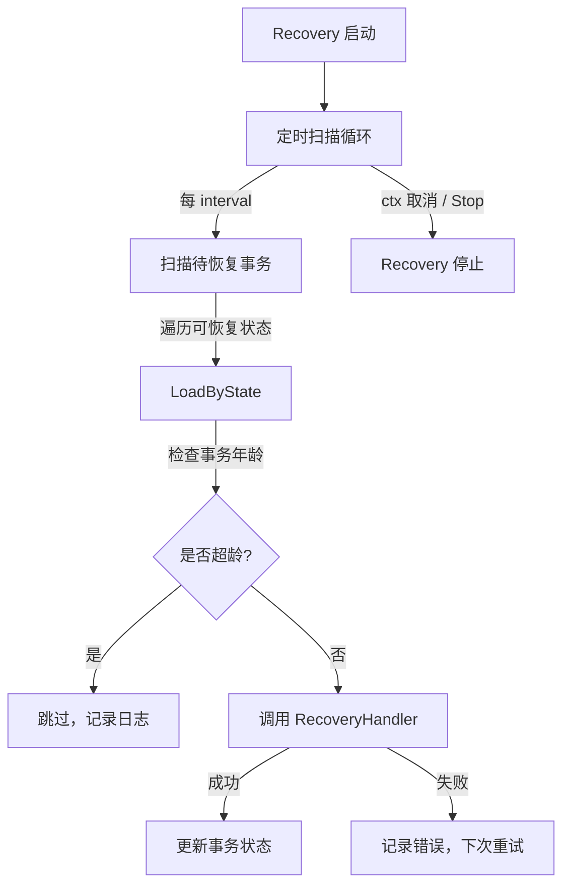
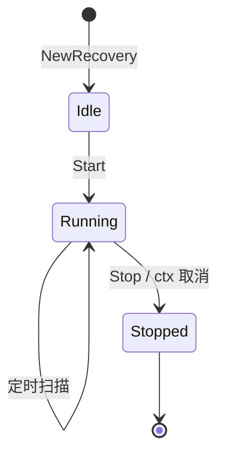

# Recovery 恢复

Recovery 是 go-distsaga 的崩溃恢复模块，定时扫描存储中处于异常状态的事务并重试，确保事务最终完成

## 工作原理



## 可恢复状态

Recovery 扫描以下状态的事务：

| 状态 | 说明 | 恢复策略 |
|------|------|----------|
| SUSPENDED | 补偿/确认失败，挂起 | 重试失败的操作 |
| COMPENSATING | 正在补偿中 | 继续执行补偿 |
| CONFIRMING | 正在确认中 | 继续执行确认 |
| CANCELING | 正在取消中 | 继续执行取消 |
| COMMITTING | 正在提交中 | 继续执行提交 |
| ABORTING | 正在中止中 | 继续执行回滚 |

## 核心概念

### RecoveryHandler

恢复处理函数，接收待恢复的事务并执行恢复逻辑：

```go
type RecoveryHandler func(ctx context.Context, tx *Transaction) error
```

### 事务年龄

Recovery 检查事务的创建时间，超过 `maxAge` 的事务将被跳过，避免无限重试过期事务：

```go
func (r *Recovery) isExpired(tx *Transaction) bool {
    if r.maxAge <= 0 {
        return false
    }
    return time.Since(tx.CreatedAt) > r.maxAge
}
```

## 使用示例

### 通过 Runtime 启动

```go
package main

import (
    "context"

    "github.com/kamalyes/go-distsaga/runtime"
)

func main() {
    rt, _ := runtime.New(
        runtime.WithEnableRecovery(true),
        runtime.WithRecoveryInterval(5*time.Second),
        runtime.WithRecoveryMaxAge(48*time.Hour),
    )

    ctx := context.Background()
    rt.StartRecovery(ctx)

    // ... 执行事务 ...

    rt.StopRecovery()
}
```

### 注册自定义恢复处理函数

```go
recovery := distsaga.NewRecovery(adapter, logger, 10*time.Second, 24*time.Hour)

recovery.RegisterHandler(func(ctx context.Context, tx *distsaga.Transaction) error {
    switch tx.Mode {
    case distsaga.ModeSaga:
        return recoverSaga(ctx, tx)
    case distsaga.ModeTCC:
        return recoverTCC(ctx, tx)
    case distsaga.ModeXA:
        return recoverXA(ctx, tx)
    case distsaga.ModeOutbox:
        return recoverOutbox(ctx, tx)
    default:
        return fmt.Errorf("unsupported mode: %s", tx.Mode)
    }
})

recovery.Start(ctx)
```

### 恢复 SAGA 事务

```go
func recoverSaga(ctx context.Context, tx *distsaga.Transaction) error {
    switch tx.State {
    case distsaga.StateCompensating:
        // 继续执行未完成的补偿
        for i := len(tx.Steps) - 1; i >= 0; i-- {
            if tx.Steps[i].Status == distsaga.StateCommitted {
                if err := compensateStep(ctx, tx.Steps[i]); err != nil {
                    return err
                }
            }
        }
        return tx.TransitionTo(distsaga.StateCompensated)
    case distsaga.StateSuspended:
        // 重试补偿
        return retryCompensate(ctx, tx)
    default:
        return nil
    }
}
```

## 配置参数

| 参数 | 选项函数 | 默认值 | 说明 |
|------|----------|--------|------|
| 扫描间隔 | `WithRecoveryInterval` | 10s | 每次扫描的时间间隔 |
| 最大事务年龄 | `WithRecoveryMaxAge` | 24h | 超过此年龄的事务不再恢复 |
| 是否启用 | `WithEnableRecovery` | true | 是否在 Runtime 创建时启动恢复 |

## 依赖条件

Recovery 依赖 `FilteredStoreAdapter` 接口的 `LoadByState` 方法如果适配器未实现此接口，Recovery 将跳过扫描：

```go
filtered, ok := r.adapter.(FilteredStoreAdapter)
if !ok {
    return nil // 适配器不支持按状态加载，跳过
}
```

**注意**：MemoryAdapter 实现了 `FilteredStoreAdapter`，Redis 和 GORM 适配器实现了 `FullStoreAdapter`（包含 `FilteredStoreAdapter`）

## 生命周期



### 启动

```go
recovery.Start(ctx)
```

- 启动后台 goroutine 执行定时扫描
- 重复调用 `Start` 不会启动多个 goroutine
- 支持 context 取消

### 停止

```go
recovery.Stop()
```

- 关闭停止信号通道
- 使用 `sync.Once` 确保只执行一次
- 重复调用 `Stop` 不会报错

## API 参考

### NewRecovery

```go
func NewRecovery(adapter StoreAdapter, l logger.ILogger, interval, maxAge time.Duration) *Recovery
```

创建崩溃恢复器

**参数**：
- `adapter` — 存储适配器（需实现 FilteredStoreAdapter 才能扫描）
- `l` — 日志记录器
- `interval` — 扫描间隔
- `maxAge` — 事务最大年龄

### RegisterHandler

```go
func (r *Recovery) RegisterHandler(handler RecoveryHandler)
```

注册恢复处理函数

### Start

```go
func (r *Recovery) Start(ctx context.Context) error
```

启动崩溃恢复已运行时重复调用返回 nil

### Stop

```go
func (r *Recovery) Stop()
```

停止崩溃恢复使用 `sync.Once` 保证只执行一次
